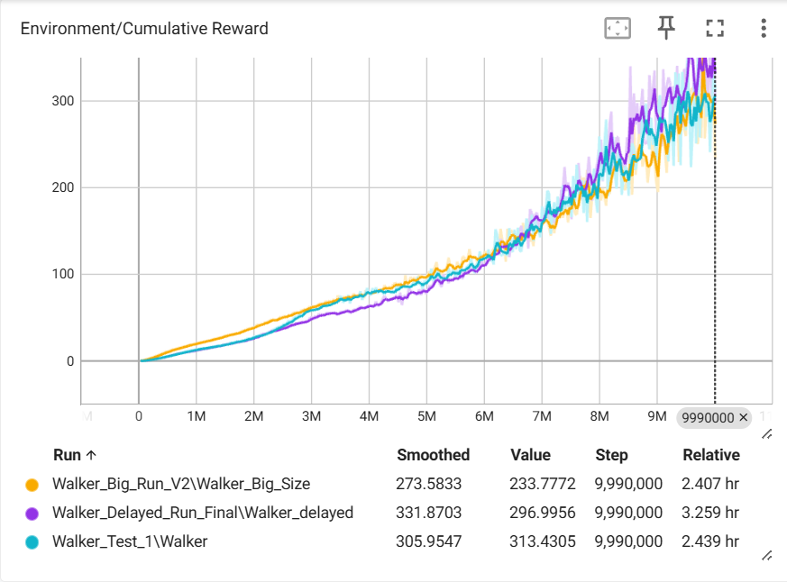
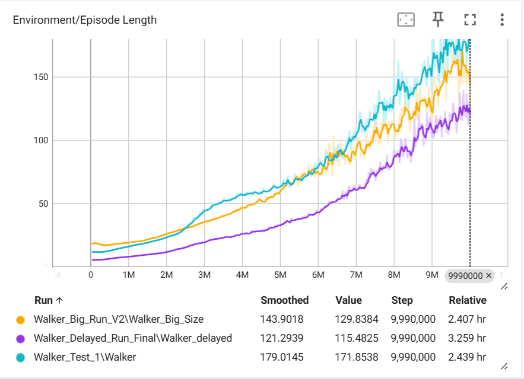
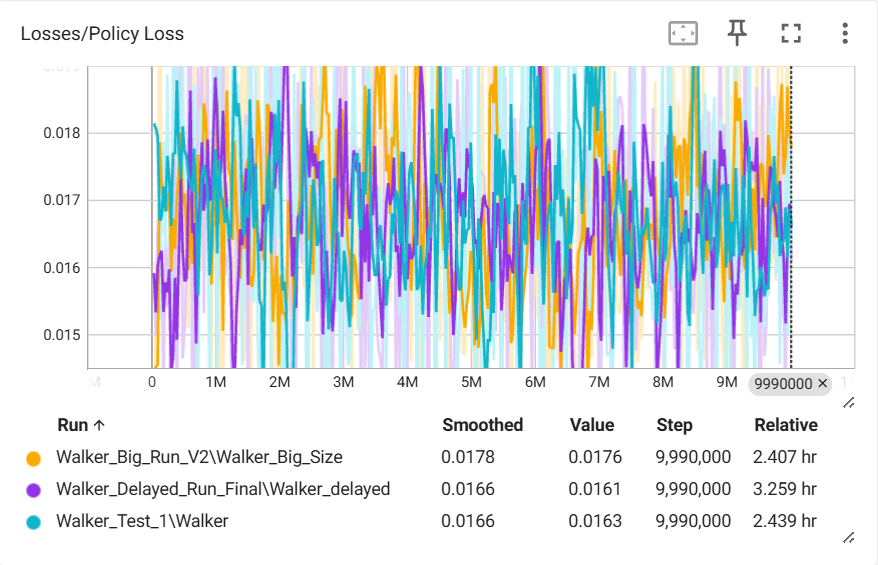

# Impact of Biophysical & Neurological Constraints on Locomotion Learning

**身体的・神経的制約がAIの歩行学習に与える影響**


---

## 概要 / Overview

本リポジトリは **Unity ML-Agents** を用いた強化学習実験プロジェクトです。

研究目的は、

> **身体的制約（スケール変化による筋力比低下）** および
> **神経的制約（意思決定・反応の遅延）**

が、**二足歩行の学習戦略や運動様式にどのような影響を与えるか** を検証することです。

---

## 研究背景 / Motivation

実世界の生物は、

* 体格差による力学的不利
* 神経伝達や認知処理の遅延

といった制約の中で運動を最適化しています。

本研究ではこれらを **人工エージェントに明示的に課す** ことで、
制約下で生じる **戦略の変化・特化的適応（Specialized Evolution）** を観察します。

---

## 環境 / Requirements

### Unity

* **Unity Editor**: `6000.3.2f1` (Unity 6)
* **ML-Agents (C#)**: `4.0.0`

### Python

* **Python**: `3.10`（推奨）
* **ml-agents**: `1.2.0.dev0`
* **ml-agents-envs**: `1.2.0.dev0`

> ⚠️ PyTorch は CUDA 環境に応じて別途インストールしてください。

---

## セットアップ / Installation

### 1. リポジトリの取得

```bash
git clone https://github.com/kmtkzy1379/portfolio5-RL.git
cd portfolio5-RL
```

### 2. Unity プロジェクト

1. Unity Hub → **Add**
2. `Project/` フォルダを指定
3. Unity `6000.3.2f1` で起動

※ 初回起動時はパッケージ解決に時間がかかります。

### 3. Python 環境

```bash
python3.10 -m venv .venv
source .venv/bin/activate  # Windows: .venv\Scripts\activate

pip install -U pip setuptools wheel
pip install -e ./ml-agents-envs
pip install -e ./ml-agents
```

---

## 使い方 / Usage

1. Unity Editor で学習用シーンを開く
2. **Behavior Parameters** が正しく設定されていることを確認
3. ターミナルで各モデルに対応する設定ファイルを指定して実行

```bash
# Baseline Model
mlagents-learn config/normal.yaml --run-id=normal_run --train

# Scale Model（身体的制約）
mlagents-learn config/scale.yaml --run-id=scale_run --train

# Delayed Model（神経的制約）
mlagents-learn config/delayed.yaml --run-id=delayed_run --train
```

4. Unity Editor で ▶ **Play**

---

## 実験設計 / Experiments

### 比較モデル

#### 1. Baseline Model（標準）

* 標準的な体格・反応速度
* Decision Period: **10フレーム毎**

#### 2. Scale Model（身体的制約）

| パラメータ | 値 | スケーリング則 |
|:---|:---|:---|
| 身長 | **1.5倍** | — |
| 質量 | **3.375倍** | 体積則（1.5³） |
| 筋力 | **2.25倍** | 断面積則（1.5²） |
| 相対筋力 | **約66%** | 筋力 / 質量 |

体積則に従い質量は **1.5³ = 3.375倍** に増加する一方、筋力は断面積則により **1.5² = 2.25倍** に留まります。
結果として **相対的な筋力不足** が発生し、「体が重い」状態を再現しています。

#### 3. Delayed Model（神経的制約）

| パラメータ | Baseline | Delayed Model |
|:---|:---|:---|
| Decision Period | 10フレーム毎 | **20フレーム毎（2倍）** |

行動決定の間隔を標準の2倍に設定し、神経伝達の遅延をシミュレートしています。

### 報酬設計 / Reward Design

本実験で使用した報酬関数は以下の要素で構成されています。

| 報酬要素 | 内容 | 目的 |
|:---|:---|:---|
| 前方移動報酬 | 前方への移動距離に応じた正の報酬 | 歩行の学習を促進 |
| 転倒ペナルティ | 転倒時に負の報酬を付与しエピソード終了 | 安定性の維持 |
| 存在報酬 | 各ステップで微小な正の報酬 | 長時間の生存を促進 |

> 報酬関数は全モデル共通で、制約条件のみを変化させることで純粋な戦略変化を観察しています。

---

## 結果 / Results

### 学習推移グラフ

Normal（水色）、Scale（オレンジ）、Delayed（紫）の3モデルの学習推移:

<div align="center">

| 累積報酬 | 生存時間 | 学習損失 |
|:---:|:---:|:---:|
|  |  |  |

</div>

### 結果サマリ

| モデル | 累積報酬の傾向 | 生存時間の傾向 | 学習損失 | 獲得された戦略 |
|:---|:---|:---|:---|:---|
| Baseline | 安定的に上昇 | 最も安定 | 低い変動で収束 | 標準的な歩行 |
| Scale Model | Baselineに次ぐ | 安定（Baselineに近い） | 安定的に収束 | 低速・安定志向の保守的歩行 |
| Delayed Model | 初期に苦戦するが最終的に最高スコア | 極端に短い | 変動が激しい | 転倒リスクの高い高報酬行動 |

---

## 考察 / Discussion

### 各モデルの適応戦略

* **Scale Model（慎重な保守派）**
  **「ゆっくり歩くが、転びにくい」** 戦略を獲得。重心を低く保つ省エネ型のフォームで、長い生存時間を確保する方向に最適化されました。

* **Delayed Model（ハイリスク・ハイリターン）**
  **「転ぶまでの短時間に大股で距離を稼ぐ」** 極端な戦略を獲得。反応の遅さを補うために、1ステップあたりの移動量を最大化する方向へ特化しました。

### 知見

* 制約は単なる性能低下ではなく **戦略空間の再構成** を引き起こす
* 神経遅延は「慎重さ」ではなく **「投機性」** を誘発する場合がある
* 身体制約は運動の **安定性を優先する方向** へ適応を促す
* **「ある機能の制約が、別の機能の過剰な発達や独自の戦略を生む」** という、人間のニューロダイバーシティ（神経多様性）にも通じる現象をAIが自律的に再現した

---

## デモ動画 / Demo

各モデルの歩行デモを YouTube で公開しています。

* [Baseline Model デモ](https://www.youtube.com/watch?v=5l4HtgaiFiQ)
* [Scale Model デモ](https://www.youtube.com/watch?v=87Y8skBoFfM)
* [Delayed Model デモ](https://www.youtube.com/watch?v=1UfdKVYhGY4)
* [3モデル比較](https://www.youtube.com/watch?v=8NeEWOQXfY8)

---

## License

MIT License

---

## Author

**kmtkzy1379**
